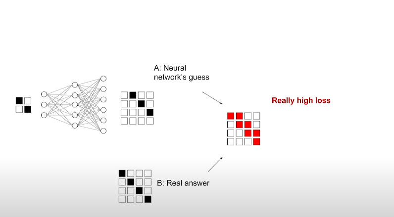

# Tfjs ESRGAN
A [Tensorflow.JS](https://tensorflow.com/js) wrapper of ESRGAN based off the [ESRGAN Tensorflow Implementation](https://github.com/captain-pool/GSOC/tree/master/E2_ESRGAN). Made with Typescript, Python, Node.js, and tensorflow.js.

## How ESRGAN works
Image Enhancement is a hard problem. In tv-shows, the police are able to magicially enhance low quality images into crisp and clearer versions. However, its very difficult for algorithms like Nearest Neightbor and Bicubic Interpolation to achieve sharp images. Turning to Neural Nets, reasearchers have been able to train Convolutional Neural Nets ([SRCNN](https://arxiv.org/abs/1501.00092)) to enhance images, with mild success rates. However, due to innaccuracies in loss functions such as Mean Squared Error, the neural network learns to minimize loss by "playing it safe," and averaging out pixel weights. Therefore, this is not viable for out tv-quality sharp images.  However, by switching to a GAN, or Generative Adversarial Network, we can mitigate some of the problems caused by our CNN. A Generative Adversarial Network functions by using two Neural Networks, commonly known as the "Generator" and the "Discriminator." The generator network is the neural network we want to train, and the discriminator is a neural net that evaluates the performance of our generator. The generator tries to fool the discriminator Neural Net, which can be measured by an increase in the loss function of the discriminator. The discriminator then tries to fool the generator, which can be measured by the increase in the generator's loss. This cycle repeats until the discriminator network has a hard time fooling the Generator, which we can then use to generate values. It is important to note that the generator does not change while the discriminator trains, and vise-versa when the generator trains. A more in-depth resources on GANs can be found in the [Original Paper](https://arxiv.org/abs/1406.2661) and the [Google Crash Course On GANs](https://developers.google.com/machine-learning/gan/generative), and an application of GANs can be found [here](https://www.tensorflow.org/tutorials/generative/dcgan#what_are_gans). In our case, the generator function in our SRGAN (Super Resolution GAN) is the model that will enlarge our image, and the discriminator will tell if that image looks fake or not. A popular pretrained network used as a discriminator is [VGG19](https://www.kaggle.com/keras/vgg19/home). After training, our model should produce much higher quality images. We can make our bot even better through various optimizations, like geting rid of the batch norm layer, and using a Residual-in-Residual Dense Block (RRDB) instead. View the full ESRGAN optimizations in the (ESRGAN Paper)[https://arxiv.org/abs/1809.00219].

## Resources
### Images 
* **[GAN STRUCTURE](https://developers.google.com/machine-learning/gan/gan_structure)**
* **[SRCNN PROBLEMS](https://www.youtube.com/watch?v=RhUmSeko1ZE&t=364s)**
### Referenced Links
* **[SRCNN](https://arxiv.org/abs/1501.00092)**
* **[Original Paper](https://arxiv.org/abs/1406.2661)**
* **[Google Crash Course On GANs](https://developers.google.com/machine-learning/gan/generative)**
* **[Gan Tensorflow Demo](https://www.tensorflow.org/tutorials/generative/dcgan#what_are_gans)**
* **[VGG19](https://www.kaggle.com/keras/vgg19/home)**
* **[ESRGAN Paper](https://arxiv.org/abs/1809.00219)**
